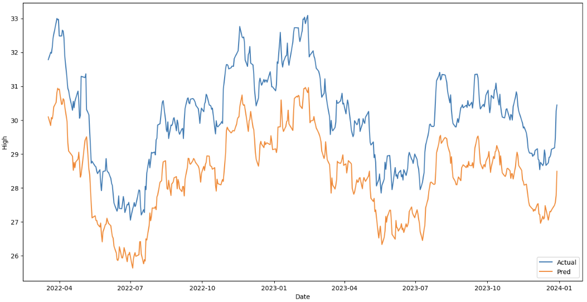

# Stock Price Prediction Using LSTM

This project predicts the high stock prices for a company using historical stock data. The model uses data from Yahoo Finance spaning eight years for training (up to December 2021) and the year 2022 for testing. The prediction model is built using an LSTM network.

Result:


## Prerequisites
- Python 3.12.0
- pip

## Installation

1. **Clone the project**
```bash
git clone https://github.com/pravin006/stock-prediction_LTSM.git
cd stock-prediction_LTSM
```

2. **Create virtual environment and install dependecies**
```bash
python -m venv venv
venv\Scripts\activate
pip install -r requirements.txt
```

3. **Run in Jupyter Notebook server**
```bash
jupyter notebook
```
Navigate to the script.ipynb file in the interface that opens in the browser and run all cells.

